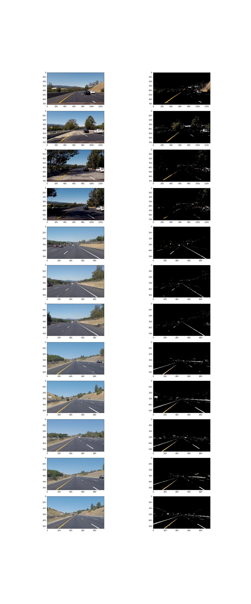
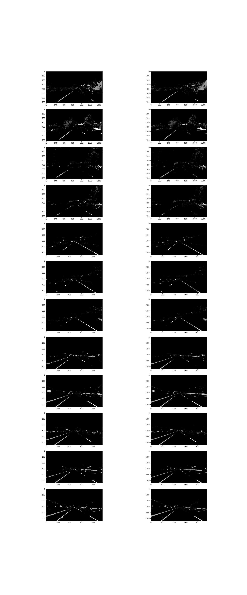
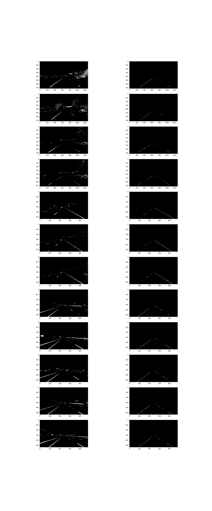
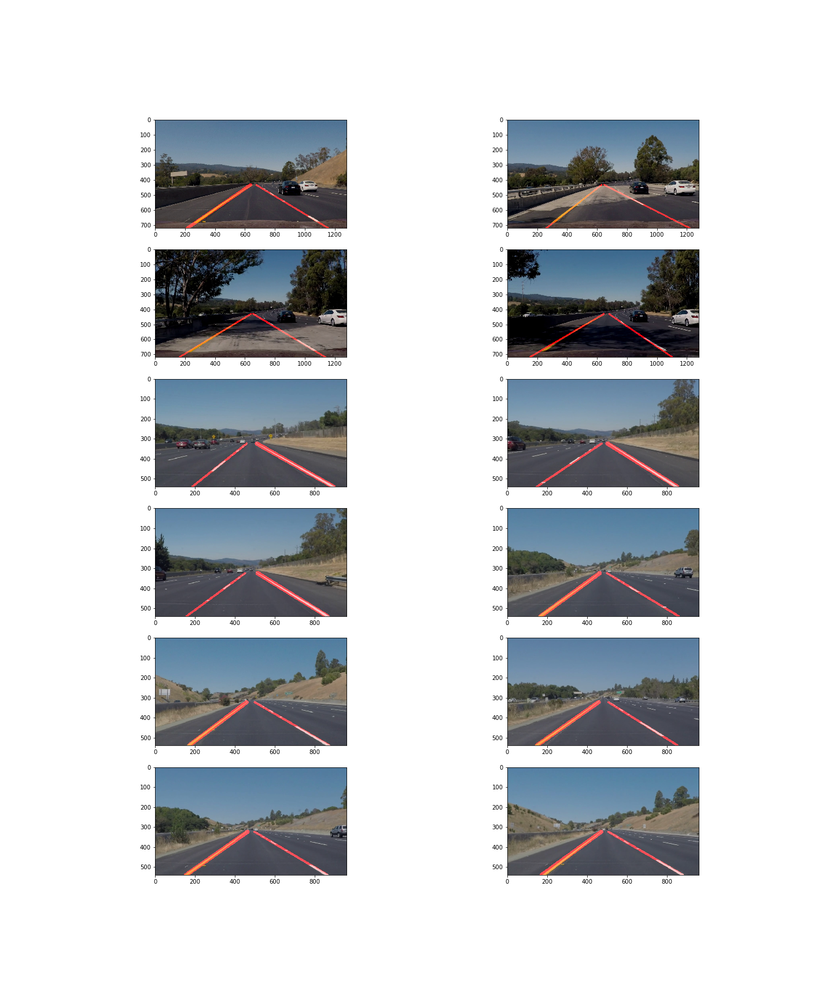

# **Finding Lane Lines on the Road** 

One of the most important factors when driving a car is knowing the lane line on the road. Similar to the way we see it, we use algorithms to create a program that detects lane lines on the road. This is expected to be the starting point for developing Self-Driving-Car.
---

# Processing

## Color Filter using HSV Color space
There are many papers that have shown that HSV provides the best performance when looking at various papers for edge detection from images. Refer to the relevant paper and detect the lane using the HSV color filter. At this time, I tried to use union thresholds are applied to extract lane line for every video.

## Gray Scale and Gaussian Blur
The filtered image to Gray color before proceeding with Edge Detection. OpenCV's simple functions enable image conversion. Now it's ready for canny edge detection.

## Canny Edge Detection
Extract edge points. It can be extracted simply by using the function of OpenCV. And we extract the desired part by masking the area of interest. The number of straight lines extracted by the Hope Transform on a single screen would be detected.

## calculrate final line
Lanes usually consist of left and right lines. In addition, multiple lines can be detected for one lane. Assuming that the slope of both lines is different, I classify them into two groups based on the slope.
Calculate the average line segment by using the length weight of the line segments included in each group.
In this process, the solid line and the segment line can be distinguished according to the length of the longest line.

## draw a line on image
I assumed that the position of the lane recognition camera is fixed on the car and set the vertical heigh of the lane on the screen. I set the 60% ~ 100% area(from top) to expand the final line. Finally, I add the line to the image with translucency to increase the visibility. I expresses the thickness of the solid line and the dotted line differently.

## Video Processing using Pipeline
As a result of simple video processing, the expression in each frame was able to see shaking between results. Of course, if I process a single image perfectly, it will not experience shaking or jittering. I acknowledged that there may be errors in such parts and added the processing of the current frame by referring to the results of the previous frame when producing the processing result.

Youtube video link
---
[white_simple](https://youtu.be/uLD3xUvJKsc) vs [frame_averaged](https://youtu.be/YOjLEJ6Ac2k)
---
[yellow_simple](https://youtu.be/RpQ30o0uLO0) vs [frame_averaged](https://youtu.be/LRbpIIRKVXM)
---
[Complicated](https://youtu.be/3oEpNG6CN0U)
---

# potential shortcomings
## Detection error due to fixed threshold
I tried to detect lanes of each image using a single threshold. But the results were not satisfactory. Threshold is different in each video even white line or yellow line, and Threshold which can cover shadow area causes another error. I took the union value that can extract the lane in three images, but the detection error also occurred.

## Lane type recognition error
In this page, the type of lane line is recognized according to the range of the straight line detected simply. However, the presence of error shadows in the threshold and the exfoliation of the paint caused confusion in the distinction.

# possible improvements
## Apply Dynamic Color Threshold
In a real environment, the color space of the line will change according to time (morning, afternoon, night) and weather (cloudy, rain, clear). Would not it be possible to filter better if we could set the range of the reference color under certain conditions and apply the difference according to the environmental change? The easiest example would be a good reference to the car's bonnet color. Based on the color of a location that does not change in a controlled environment, the color space of the location will change according to various environmental changes. Could it be possible to naturally change the critical point to be recognized according to the amount of change?

## Lane recognition in other way
A. In this project, a lane is extracted using a simple color space filter. However, applying Deep Learning such as CNN to extract lane, maybe it would be better.

# References
http://www.iraj.in/journal/journal_file/journal_pdf/3-21-139086923407-10.pdf
